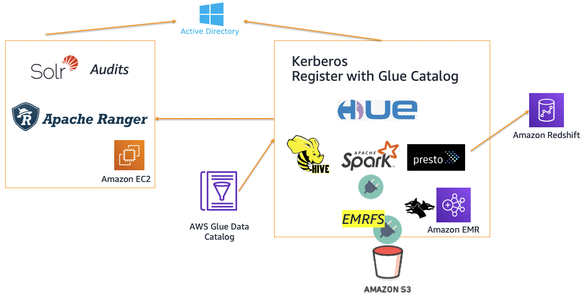

## Authorization and Auditing on Amazon EMR Using Apache Ranger

The repo provides reference architecture to deploy [Apache Ranger](https://ranger.apache.org/) on [Amazon EMR](https://aws.amazon.com/emr/). Apache Ranger is a framework to enable, monitor, and manage comprehensive data security across the Hadoop platform. 
Features include centralized security administration, 
fine-grained authorization across many Hadoop components (eg - Hadoop, Hive, HBase, Storm, Knox, Solr, Kafka, and YARN) and central auditing. 
It uses agents to sync policies and users, and plugins that run within the same process as the Hadoop component, like NameNode and HiveServer2.

The repo contains code tied to [AWS Big Data Blog](https://aws.amazon.com/blogs/big-data/implementing-authorization-and-auditing-using-apache-ranger-on-amazon-emr/)

> **Development Status** the code has gone through unit and functional test against a **few recent versions** of Amazon EMR. 
> It is likely that it may not work with **all** EMR versions.
> Plugins marked as **beta** has not been tested in production.
>> Please submit Pull Request or to create an [Issue](https://github.com/varunrao/aws-blog-emr-ranger/issues/new)
>
### Deployment options: 

| Module | Cloudformation stack | Architecture | Description |
| ---------------- | --- | --- |-------------------------------------------------------- |
| [Basic setup with LDAP](v1) |  |  | Basic deployment using [AWS Simple AD](https://docs.aws.amazon.com/directoryservice/latest/admin-guide/directory_simple_ad.html), Hive and HDFS plugins and optional Presto Plugin|
| [AD setup with Kerberos](v2) |  |  | Deployment using [Microsoft AD server](https://docs.microsoft.com/en-us/windows-server/identity/ad-ds/get-started/virtual-dc/active-directory-domain-services-overview), Hive, HDFS, Spark (beta), EMRFS S3 (beta) and Presto Plugin |
| Install with existing AD and EMR | TBD | TBD | Setup that allows customers to bring your own AD server and EMR cluster. All other components (Apache Ranger server + Plugins) will be installed |

Please open Git Issues if you would like to see updates/other plugin integrations. 

> WARNING: The EMRFS S3 plugin only works when calls are made through EMRFS. By default Hive, Spark and Presto will use EMRFS to make calls to S3. Direct access to S3 outside EMRFS (Boto/cli etc) will NOT be controlled by the Ranger policies.

### References:

 - Amazon EMR: https://aws.amazon.com/emr/
 - EMRFS: https://docs.aws.amazon.com/emr/latest/ManagementGuide/emr-fs.html
 - Amazon EMR + Kerberos: https://docs.aws.amazon.com/emr/latest/ManagementGuide/emr-kerberos.html 
 - Apache Ranger: https://ranger.apache.org/
 - Apache Ranger + Amazon EMR Blog: https://aws.amazon.com/blogs/big-data/implementing-authorization-and-auditing-using-apache-ranger-on-amazon-emr/
 - Apache Ranger Presto Plugin: https://cwiki.apache.org/confluence/display/RANGER/Presto+Plugin
 - Apache Ranger Spark Plugin: https://github.com/yaooqinn/spark-ranger
