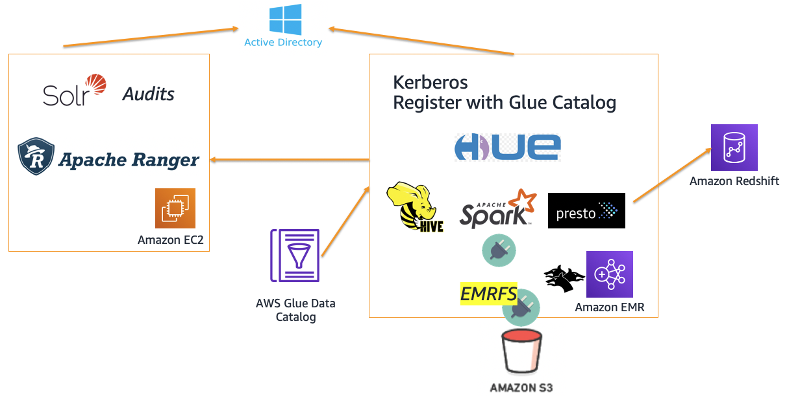

# Implementing Authorization and Auditing on Amazon EMR Using Apache Ranger
The code in this directory accompanies the AWS Big Data Blog on Implementing Authorization and Auditing on Amazon EMR Using Apache Ranger

This is V2 of the blog post with many updates

- Apache Ranger 2.0
- Windows AD server
- RDS database for Apache Ranger server
- EMR cluster with Kerberos
   * Plugins for
     * HDFS
     * Apache Hive
     * Apache Presto (prestodb)
     * EMRFS S3 plugin (beta)
     * SparkSQL Plugin (beta)

## Architecture

 

#### Warning: The EMRFS S3 plugin only works when calls are made through EMRFS. By default Hive, Spark and Presto will use EMRFS. Direct access to S3 outside EMRFS will NOT be controlled by the Ranger policies.

